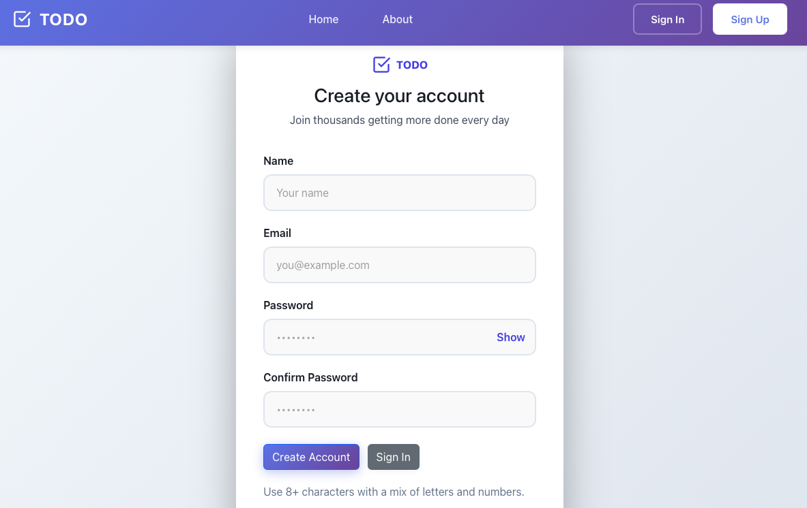

# 📝 ToDo Master

> **Organize your life with style.**  
> A powerful, full-stack Task Management System built with the MERN stack.

### 🚀 **[View Live Demo](https://todo-frontend-eosin-one.vercel.app/)**


---

## 🚀 Overview

ToDo Master is a robust and aesthetically pleasing task management application designed to help you stay organized. Built with a modern **React** frontend and a scalable **Node.js/Express** backend, it offers a seamless user experience with secure authentication and real-time updates.

## ✨ Key Features

-   **🔐 Secure Authentication**: Robust user signup and login system protected by Bcrypt.
-   **🎨 Premium UI/UX**: A clean, modern interface with responsive design for all devices.
-   **⚡ Fast & Efficient**: Optimized for performance with smooth interactions.
-   **🔄 Full CRUD**: Create, Read, Update, and Delete tasks effortlessly.
-   **📱 Responsive**: Perfectly optimized for Desktop, Tablet, and Mobile views.

---

## 📸 Application Previews

### 🏠 Home Dashboard
Manage your tasks with an intuitive dashboard.


### 👤 User Registration
Secure and simple sign-up process.


---

## 🛠 Tech Stack

This project harnesses the power of the **MERN** stack:

### **Frontend**
-    **React.js** - Component-based UI
-    **Vanilla CSS** - Custom styling
-    **Axios** - API Integration

### **Backend**
-    **Node.js** - Runtime Environment
-    **Express.js** - Web Framework
-    **MongoDB** - NoSQL Database

---

## 🏁 Getting Started

Follow these instructions to get the project up and running on your local machine.

### Prerequisites
Ensure you have the following installed:
-   **Node.js** (v14 or higher)
-   **MongoDB** (Local or Atlas)

### 📥 Installation

1.  **Clone the repository**
    ```bash
    git clone https://github.com/Ashish-Zx/to-do.git
    cd to-do
    ```

2.  **🚀 Backend Setup**
    Navigate to the backend directory and install dependencies.
    ```bash
    cd Backend
    npm install
    ```
    *Create a `.env` file in the `Backend` folder and add your MongoDB connection string.*
    ```bash
    npm start
    ```
    > Server runs on `http://localhost:1000` (or your configured port).

3.  **💻 Frontend Setup**
    Open a new terminal, navigate to the frontend directory, and start the app.
    ```bash
    cd frontend
    npm install
    npm start
    ```
    > App runs on `http://localhost:3000`.

---

## 🤝 Contributing

Contributions are what make the open-source community such an amazing place to learn, inspire, and create. Any contributions you make are **greatly appreciated**.

1.  Fork the Project
2.  Create your Feature Branch (`git checkout -b feature/AmazingFeature`)
3.  Commit your Changes (`git commit -m 'Add some AmazingFeature'`)
4.  Push to the Branch (`git push origin feature/AmazingFeature`)
5.  Open a Pull Request

---

## 📬 Contact

**Ashish-Zx**

-   🐱 **GitHub**: [Ashish-Zx](https://github.com/Ashish-Zx)
-   📂 **Repository**: [to-do](https://github.com/Ashish-Zx/to-do)

---

<p align="center">
  <i>Made with ❤️ by Ashish-Zx</i>
</p>
